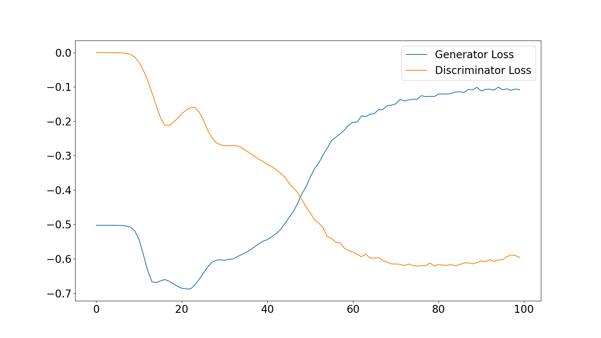
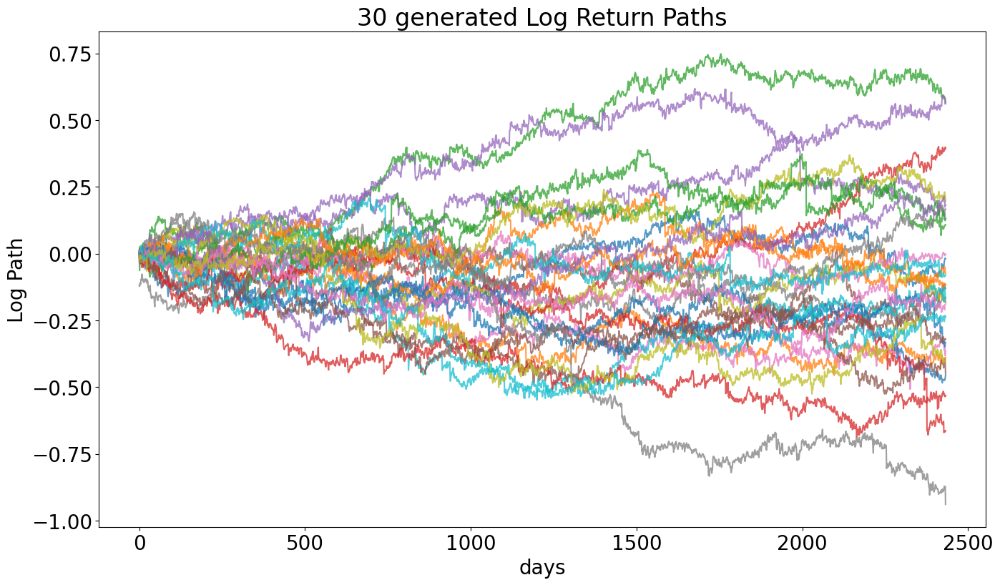
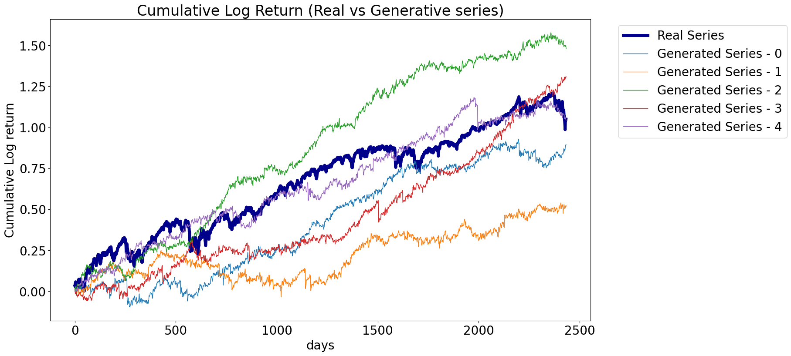
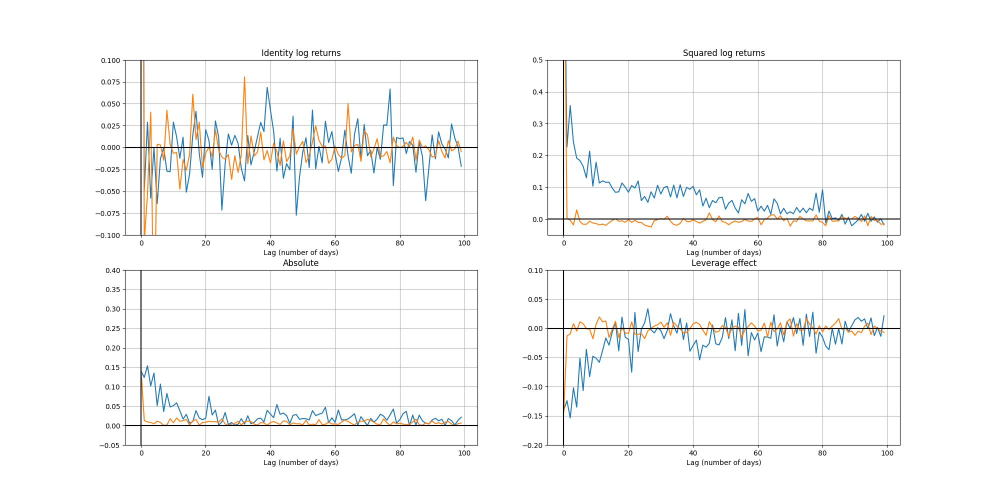
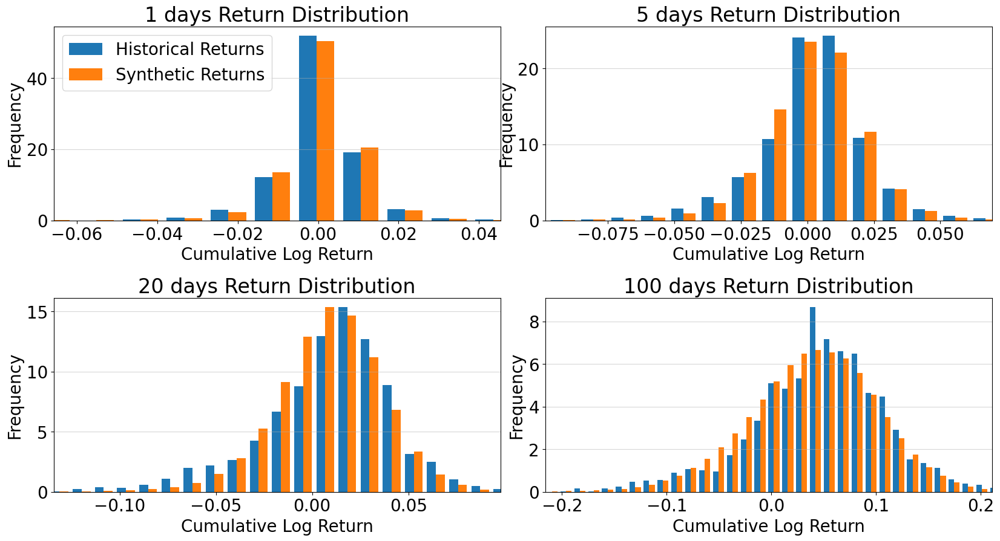

# Quant GANs

Student: Huy Pham

Email: nfam_2@edu.hse.ru

This repository demostrates the paper: [Wiese et al., Quant GANs: Deep Generation of Financial Time Series, 2019](https://arxiv.org/pdf/1907.06673.pdf)

Please the notebook [QuantGans](QuantGANs.ipynb) for detail of the model.

My work adapts many parts of these awesome repository:
* [JamesSullivan/temporalCN](https://github.com/JamesSullivan/temporalCN)
* [ICascha/QuantGANs-replication](https://github.com/ICascha/QuantGANs-replication)

## Prepare the environment

```
$ python -m venv venv
$ source venv/bin/activate
$ pip install -r requirements.txt
```

## Train

```
$ python train.py --data_path sample/sp500.csv
```

## Inference

```
$ python inference.py
```

## Results

### The training loss



### Generated Log return





### The comparison between Real vs Synthetic lag



### The comparison between Real vs Synthetic distribution




