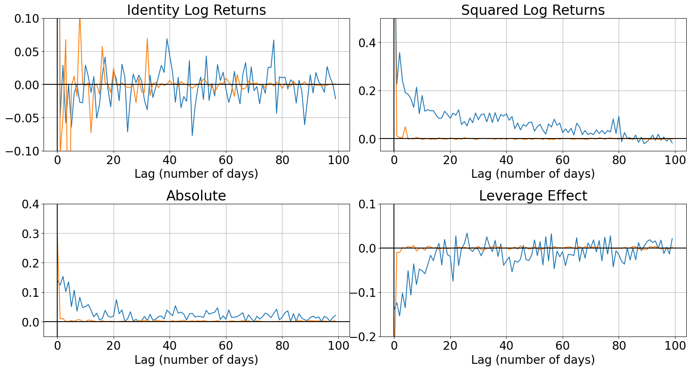
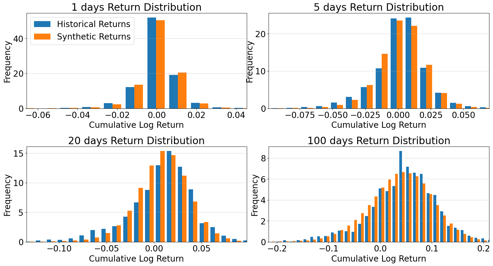

# Quant GANs

This repository demostrates the paper: [Wiese et al., Quant GANs: Deep Generation of Financial Time Series, 2019](https://arxiv.org/pdf/1907.06673.pdf)

## Install the requirements

```
$ pip install -r requirements.txt
```

## Train

```
$ python train.py --data_path sample/sp500.csv
```

## Inference

```
$ python inference.py
```

## Results

### The training loss


### The cumalative log return


### The comparison between Real vs Synthetic lag



### The comparison between Real vs Synthetic distribution




